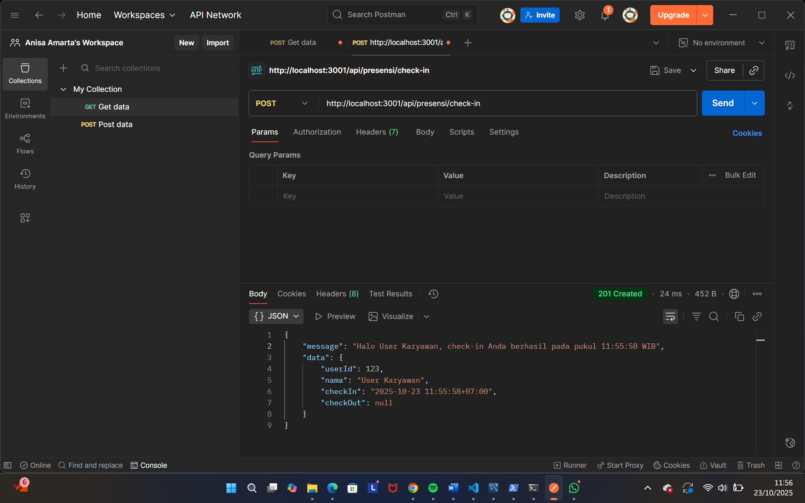
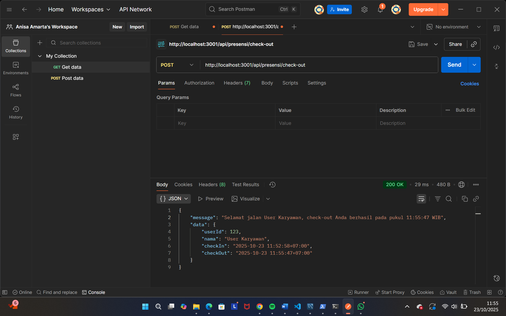
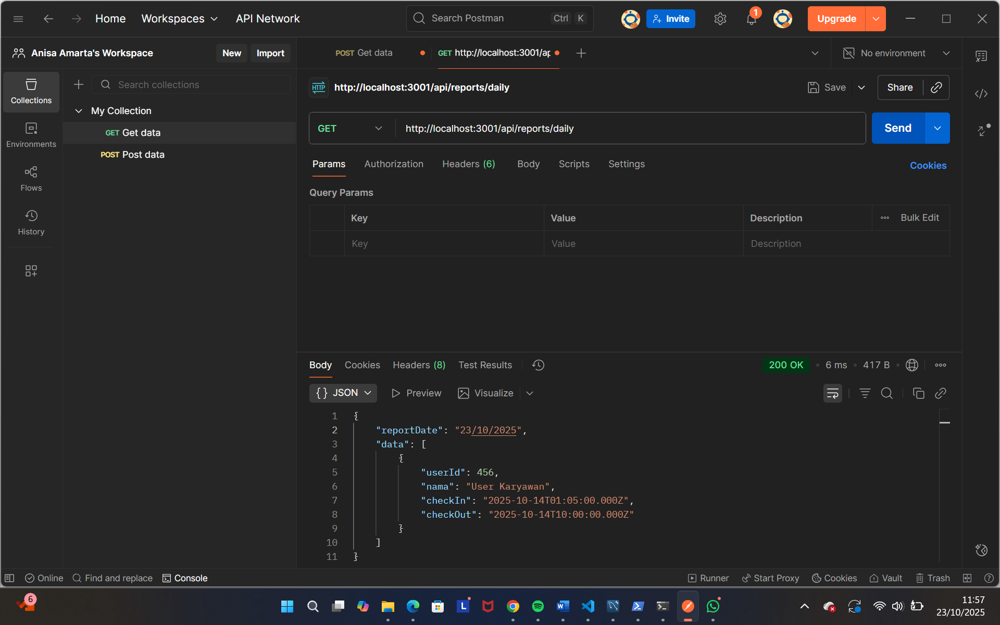
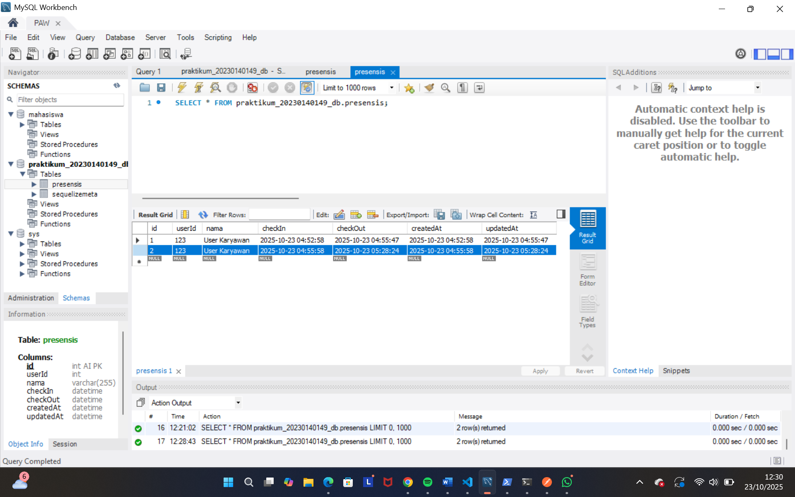

# Tugas 4 - Koneksi Database dan ORM dengan Sequelize

Nama: Annisa Dian Amarta
NIM: 20230140149
Kelas: C  

---

## Screenshots Hasil Praktikum

### 1. POST (Endpoint Presensi Check-in)

### 2. POST (Endpoint Presensi Check-out)

### 3. GET (Endpoint Report Daily)

### 4. Database setelah Check-in
