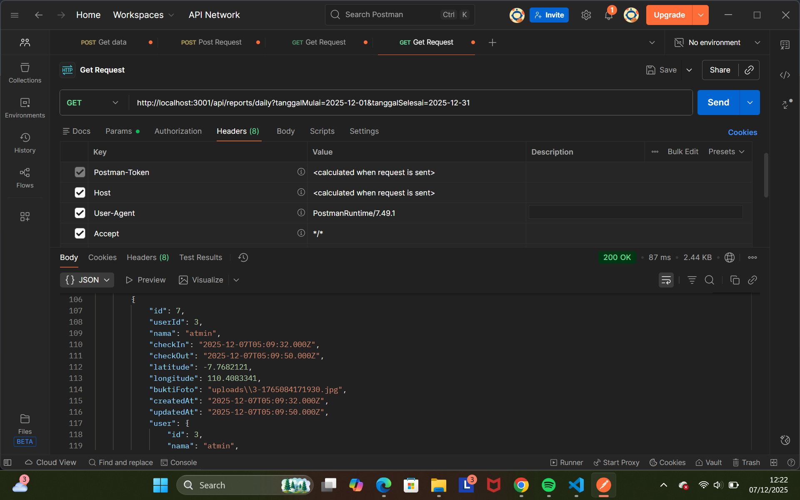
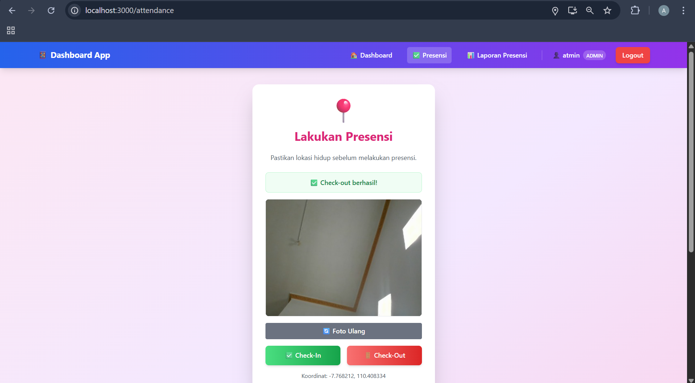
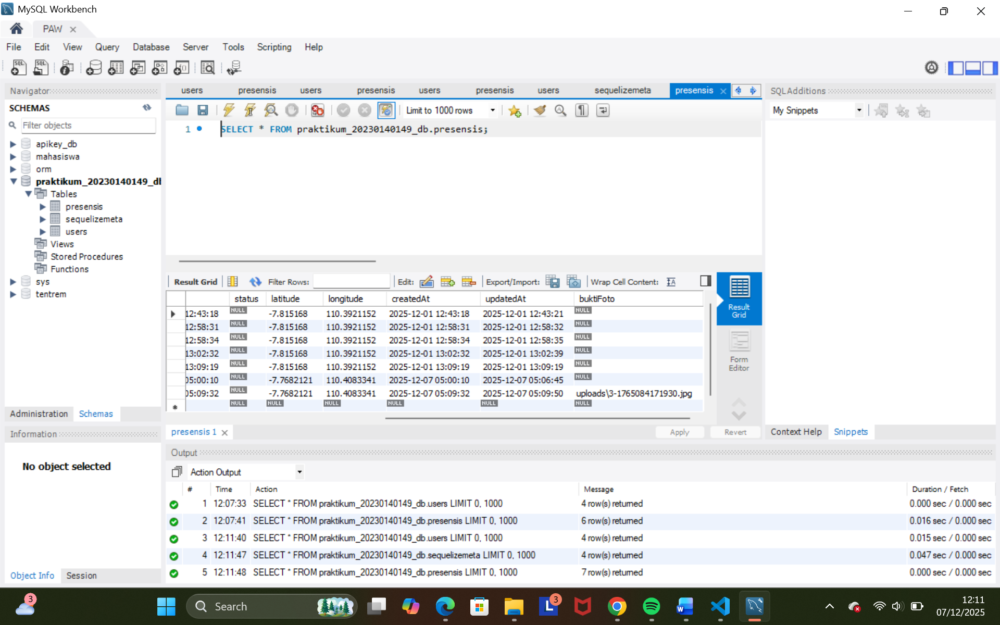
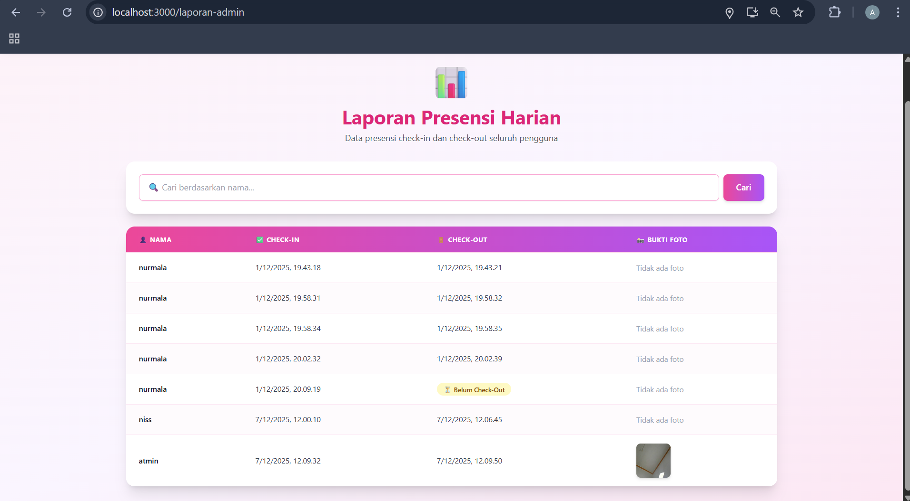
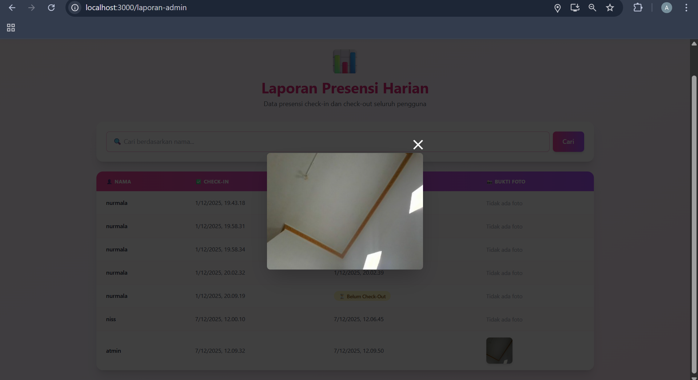

# Tugas 10 - Implementasi Sensor Kamera

Nama: Annisa Dian Amarta
NIM: 20230140149
Kelas: C  

---

## Screenshots Hasil Praktikum

### 1. GET (Laporan)

### 2. CHECK-IN ()

### 3. DATABASE ()

### 4. REPORT()

### 5. REPORT()
