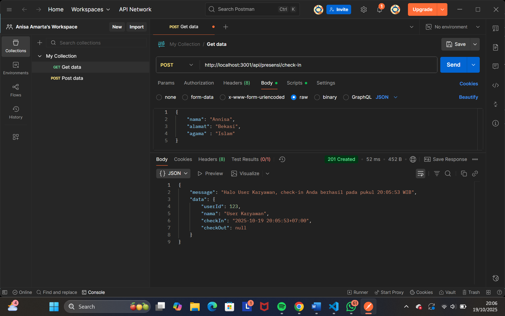
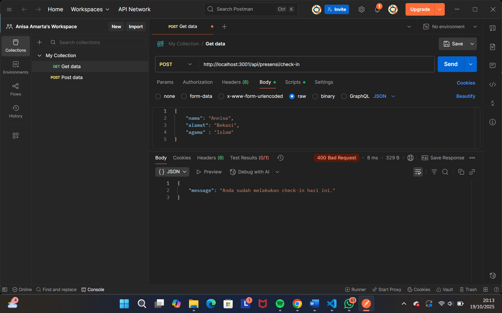
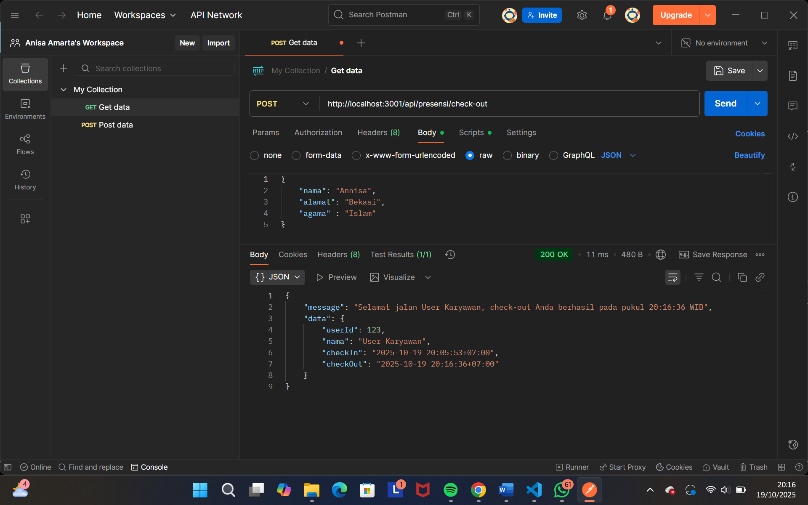
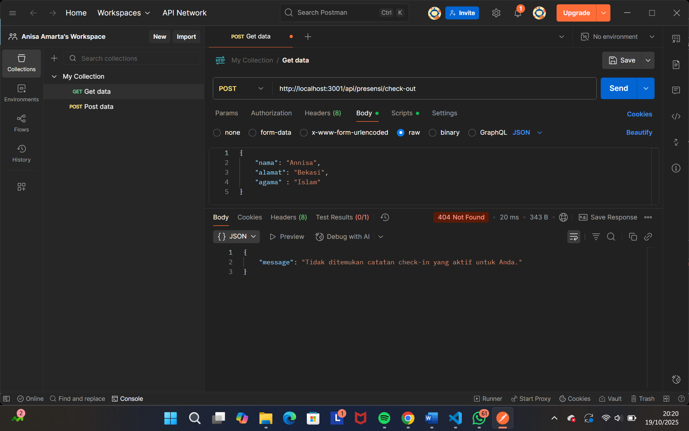
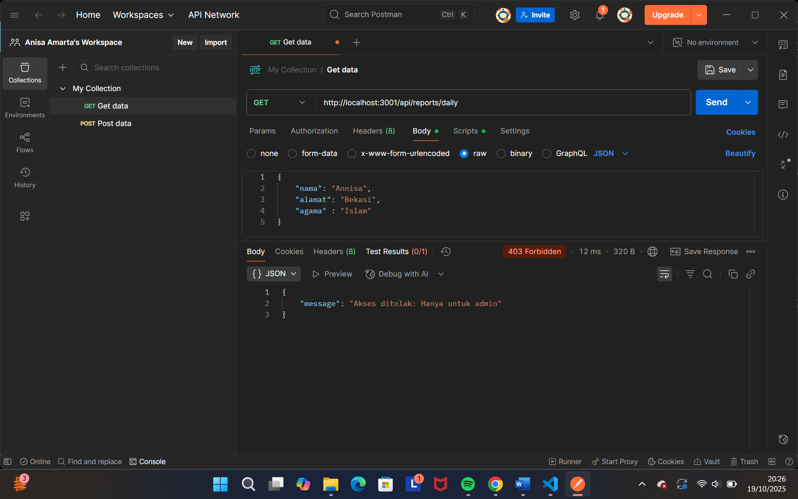
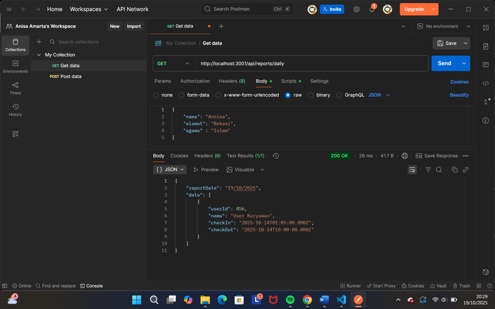

# Tugas 3 - Membuat Server HTTP dengan Node.js dan Express.js

Nama: Annisa Dian Amarta
NIM: 20230140149
Kelas: C  

---

## Screenshots Hasil Praktikum

### 1. POST (Presensi Check-in)

### 2. POST (Presensi Check-in Lebih Dari Sekali)

### 3. POST (Presensi Check-out)

### 4. PUT (Presensi Check-out Jika Belum Check-in)

### 5. Laporan Harian(Khusus Admin) Tapi Login Sebagai Karyawan

### 6. Laporan Harian(Khusus Admin) Login Sebagai Admin
