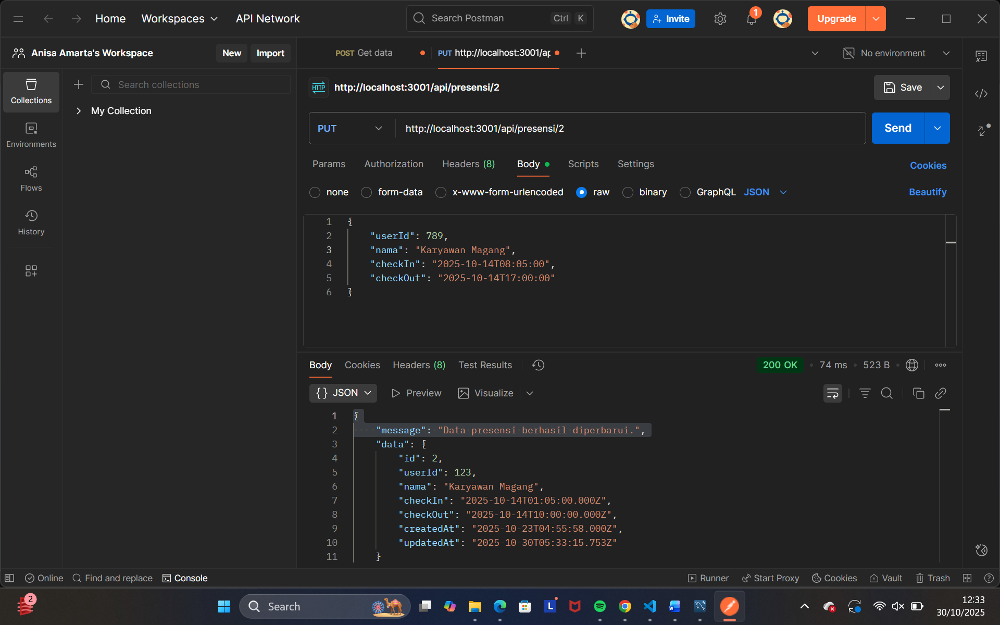
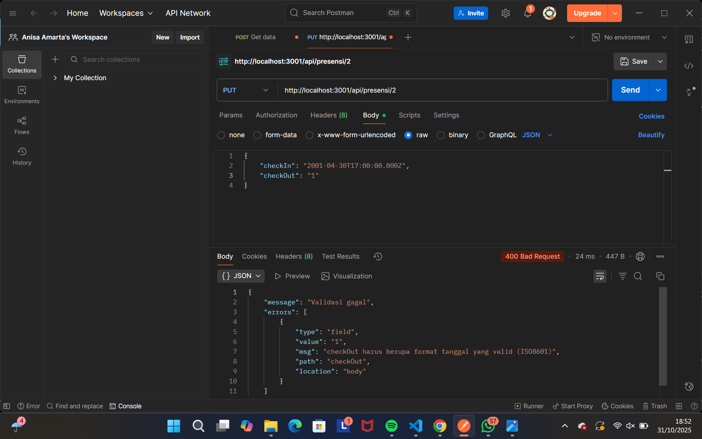
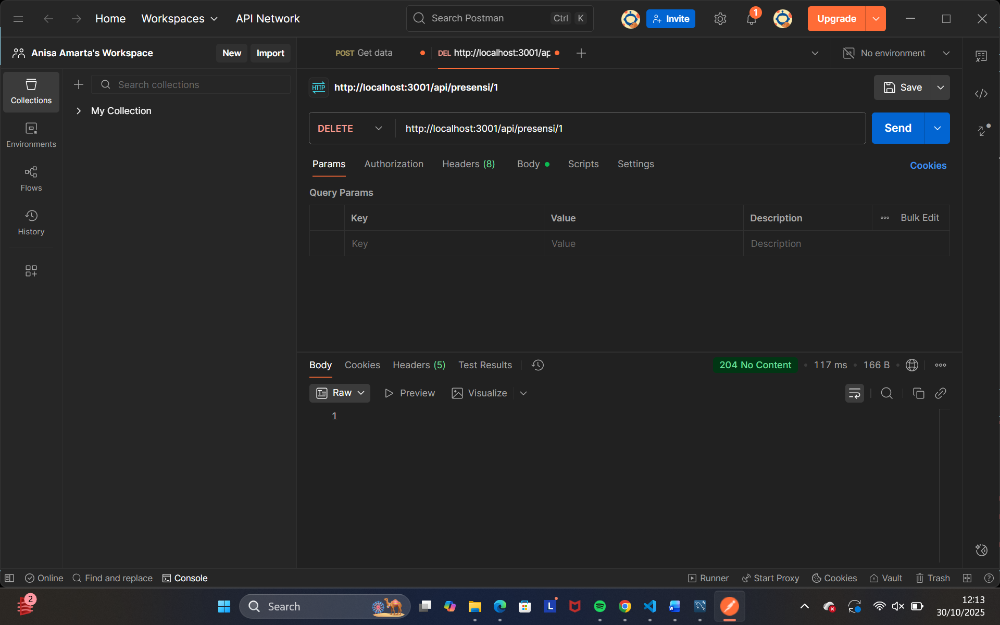
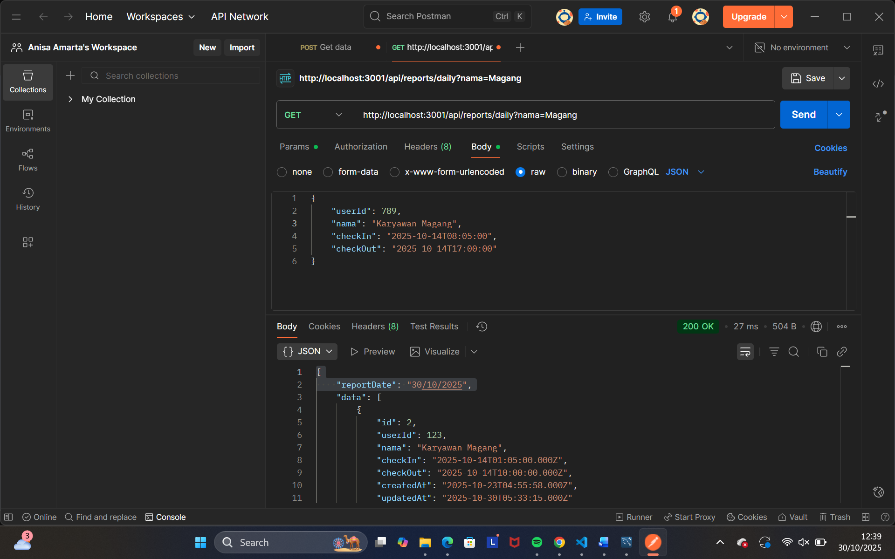
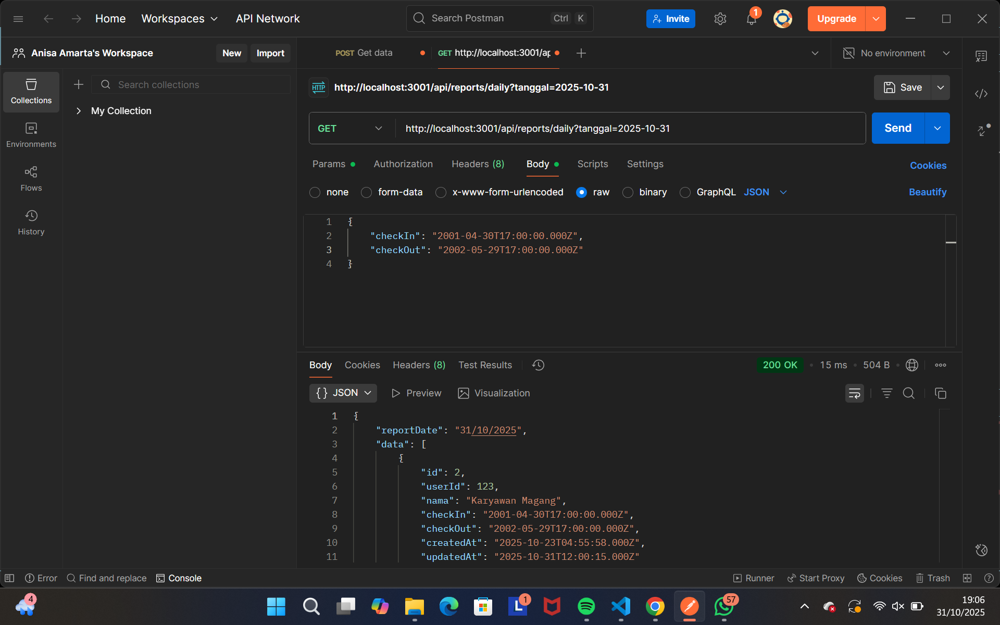
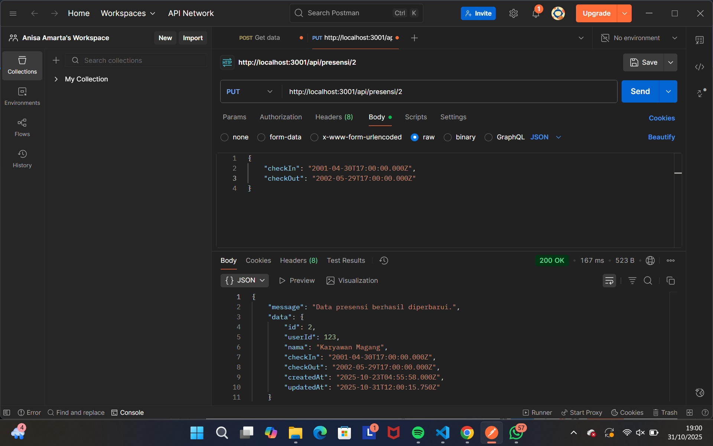

# Tugas 5 - CRUD Rest API

Nama: Annisa Dian Amarta
NIM: 20230140149
Kelas: C  

---

## Screenshots Hasil Praktikum

### 1. PUT (Endpoint update data presensi)

### 2. PUT (Endpoint update jika format tanggal yang diisi tidak valid)

### 3. DELETE (Endpoint delete data)

### 4. Enpoint search berdasarkan nama

### 5. GET (Endpoint search berdasarkan tanggal)

### 6. PUT (Endpoint update tanggal data)
